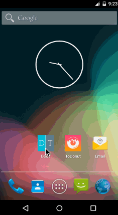

# 
(pronounced doo-t)
Doo your dooTs and doo them well!

*Prework for Codepath's Android Bootcamp Application*

Submitted by: Della Anjeh

Time spent: 17 hours spent in total (libraries are *fun*.)

Support
-------

DooT supports any API above 16.

User Stories
------------

Base functionality:

* [ ] User can **successfully add and remove items** from the todo list
* [ ] User can **tap a todo item in the list to edit them** and see their changes reflected in the todo list.
* [ ] User can **persist todo items** and retrieve them properly on app restart

The following **optional** features are implemented:

* [ ] Adding dooTs in done in a dialog fragment as opposed to in a separate activity
* [ ] All dooTs persist [into SQLite](http://guides.codepath.com/android/Persisting-Data-to-the-Device#sqlite) instead of a text file
* [ ] Improve style of the todo items in the list [using a custom adapter](http://guides.codepath.com/android/Using-an-ArrayAdapter-with-ListView)
* [ ] Adds support for completion due dates for todo items (and display within listview item)
* [ ] Additional dooT details are added, such as due date and notes
* [ ] Expand upon a dooT by tapping an item in the list to see more information about it
* [ ] Ability to mark dooTs as completed, and see that reflected in the UI
* [ ] Unique and simple UI that focuses on icons
* [ ] Utilizes icons from [Google's Material Design Icon set](https://design.google.com/icons/).
* [ ] Priority is an attribute available for all dooTs.
* [ ] Some fun and creative libraries are used in the app, I feel like listing them all would be a [spoiler](https://github.com/ChadCSong/ShineButton) [;)](https://github.com/jinatonic/confetti)
* [ ] A hamburger menu from a DrawerLayout is used for all actions in the app

Walkthrough
-----------

GIF created with [LiceCap](http://www.cockos.com/licecap/).

Notes
-----

Because I already completed an app similar to this for the last prework, I wanted to make
sure this iteration was rife with extra fun tidbits and details that I didn't have the time or ability to add last time. They always say that the devil is in the details, and they are correct. I probably spent equal amounts of time searching for up to date Android libraries and figuring out how the ones I did find worked. But I came out learning much more about what makes an app special and I feel confident that I can utilize all the fun and amazing tools available for developers in my future works. Thanks (again) for the opportunity to apply!

## Creator

---
[Della Anjeh](https://github.com/deliandjam)
